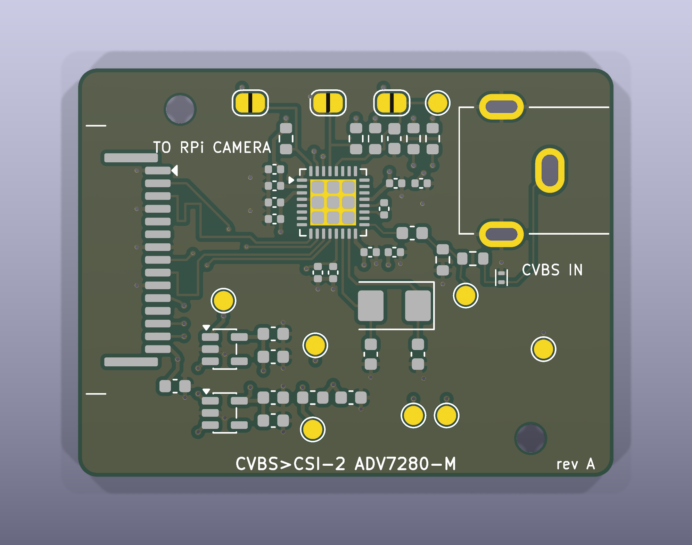

# ADV7280M-CSI2 — CVBS → MIPI CSI-2 декодер для Raspberry Pi 4

Плата на Analog Devices **ADV7280WBCPZ-M** (LFCSP-32): композитный видеосигнал (PAL/NTSC/SECAM, разъём RCA)
преобразуется в поток MIPI CSI-2 (1 лента + клок) и подаётся на разъём камеры Raspberry Pi 4.
В той же заготовке — **отделяемая секция с буфером THS7314**: один вход CVBS раздаётся на декодер и два монитора
(питание секции 5 В от внешнего DC-DC через винтовую клемму).
Работает со штатным overlay ядра Raspberry Pi без правок:

```
dtoverlay=adv728x-m,adv7280m=1
```

Проект сделан в KiCad 9 (`hw/`), плата 4 слоя **42 × 55 мм** (декодер 42 × 32 + паз 2 мм + секция буфера 42 × 21) под стек JLCPCB JLC04161H-7628.
ERC и DRC — 0 ошибок, 0 предупреждений. Все решения и допущения по этапам — в `docs/assumptions.md`,
исходные требования и выжимка из документации — в `docs/requirements.md`.



## Состав репозитория

| Путь | Что |
|---|---|
| `hw/adv7280m-csi2.kicad_pro / .kicad_sch / .kicad_pcb` | проект KiCad 9 |
| `hw/lib/` | символы ADV7280WBCPZ-M и THS7314, символы питания, посадочные места FFC (Amphenol SFW15R-1STE1LF), RCA (PSG01546), X1SON |
| `docs/schematic.pdf`, `docs/bom.csv` | схема и BOM с кодами LCSC |
| `docs/render-top.png`, `docs/render-bottom.png`, `docs/layer-*.png` | 3D-рендеры и медь по слоям |
| `docs/datasheets/`, `docs/ref/` | даташит ADV7280 Rev. A, UG-637 Rev. A, AN-1260, THS7314 (SLOS513A), схемы Pi 4 и Camera Module v2.1, overlay/драйвер из ядра Pi |
| `fab/adv7280m-csi2-gerber.zip` | Gerber (RS-274X, Protel-расширения) + Excellon drill + gbrjob со стеком |
| `fab/BOM_JLCPCB.csv`, `fab/CPL_JLCPCB.csv` | BOM и позиции в формате JLCPCB (только то, что собирает JLCPCB) |
| `tools/` | генераторы: `gen_lib.py` → `gen_fp.py` → `gen_sch.py` → `gen_pcb.py` → `route_pcb.py` → `write_pro.py`; `check_nets.py` проверяет нетлист; `fab.sh` делает Gerber/BOM/CPL, `render.sh` — картинки |

Пересборка с нуля:

```
python3 tools/gen_lib.py && python3 tools/gen_fp.py && python3 tools/gen_sch.py && python3 tools/check_nets.py
cd hw && kicad-cli sch export netlist --format kicadxml -o adv7280m-csi2.xml adv7280m-csi2.kicad_sch && cd ..
python3 tools/gen_pcb.py && python3 tools/route_pcb.py && python3 tools/write_pro.py
sh tools/fab.sh          # Gerber, drill, BOM/CPL JLCPCB, schematic.pdf, bom.csv
```

## Схема в двух словах

* **Вход**: RCA J2 → ESD TPD1E10B06 → 22 Ω последовательно, 51 Ω на землю (терминация 73 Ω, делитель 0,7) → 100 нФ → AIN1.
* **Питание**: 3,3 В с пина 15 разъёма камеры. Два LDO AP2112K-1.8: U2 → DVDD+MVDD, U3 → AVDD, PVDD через феррит.
  У каждого вывода питания чипа 100 нФ + 10 нФ.
* **Кварц** 28.63636 МГц (YXC 5032, CL 20 пФ), нагрузочные 27 пФ.
* **MIPI**: D0P/D0N → пины 3/2 разъёма, CLKP/CLKN → пины 9/8; лента 1 не используется. Дифпары 100 Ω (0,18/0,15 мм),
  длины выровнены до 0,04 мм в паре и 0,03 мм между парами.
* **I²C**: SDA/SCL → пины 14/13, подтяжки 4,7 кОм (параллельно подтяжкам Pi). ALSB = 1 → 7-битный адрес **0x21**
  (8-битный 0x42 write / 0x43 read) — ровно то, что ждёт overlay.
* **RESET**: 10 кОм + 4,7 мкФ (τ ≈ 47 мс, низкий уровень ≥ 13 мс), **PWRDWN**: 10 кОм к 3,3 В — чип запускается сам, без участия Pi.

### Секция буфера THS7314 (отделяемая)

* **Вход** J5 (штырьки 2,54 мм: 1 = сигнал, 2 = GND) → терминация 75 Ω, ESD → 3 × 100 нФ → три канала THS7314 (усиление 6 дБ, ФНЧ 8,5 МГц, sync-tip clamp).
* **Выходы** с 75 Ω последовательно (на нагрузке 75 Ω уровень 1 : 1): канал 1 → узел входа декодера (через JP4 и дорожку через перешеек),
  каналы 2 и 3 → J6 «MON1» и J7 «MON2» (штырьки, 1 = сигнал, 2 = GND) на мониторы. J8 «TO ADV» — тот же сигнал канала 1
  для случая, когда секция отломана: соединить кабелем с RCA J2.
* **Питание** J4 (винтовая клемма 5,08 мм, «+» = 5 В, «−» = GND) от внешнего DC-DC 5 В → диод SS14 (защита от переполюсовки)
  → 22 мкФ → феррит → 10 мкФ + 100 нФ. THS7314 работает от 3 до 5 В, LDO не нужен; потребление ≈ 17 мА. Тестовая точка TP9.
* **Декодер питается от Pi** (3,3 В по шлейфу камеры), клемма 5 В его не питает. Pi подключают к тому же 5 В своим кабелем.
* **Разделение**: паз 2 мм и два перешейка 2,5 мм (x = 7…9,5 и 30,5…33 мм). Через перешейки идут только CVBS_IN и земля.
  Перекусить кусачками, края зачистить. После отделения декодер 42 × 32 мм, буфер 42 × 21 мм, у каждого свои отверстия M2.

### Перемычки (паяльные, по умолчанию разомкнуты)

| | Замкнуть, если |
|---|---|
| JP1 `ALSB>GND` | нужен адрес 0x20; тогда в config.txt `dtoverlay=adv728x-m,adv7280m=1,addr=0x20` |
| JP2 `CAM_GPIO>RST` | хотите сбрасывать чип линией CAM_GPIO (пин 11 разъёма). Штатный overlay эту линию не включает, поэтому по умолчанию разомкнуто |
| JP3 `CAM_GPIO>PWRDWN` | хотите усыплять чип линией CAM_GPIO. То же самое: только со своим overlay, где включён регулятор `cam1_reg` |
| JP4 `BUF>ADV` (**замкнута** с завода) | **разрезать**, если платы соединены, а сигнал нужно подать прямо в RCA J2 минуя буфер: иначе выход буфера шунтирует вход |

### Тестовые точки

TP1 3V3 · TP2 1V8D · TP8 1V8A · TP3 SDA · TP4 SCL · TP5 RESET · TP6 GND · TP7 CVBS после терминации (сюда должно приходить ≈0,7 В p-p при 1 В на входе) · TP9 питание THS7314 (≈4,6 В).

## Подключение к Raspberry Pi 4

1. Стандартный 15-жильный шлейф камеры Pi (тот же, что у Camera Module). На плате разъём такой же, как на модуле камеры:
   контакты шлейфа **к плате**, синяя сторона к защёлке. Пин 1 (GND) помечен треугольником, он у верхнего края.
   На Pi 4: контакты шлейфа в сторону HDMI, синяя сторона к Ethernet/USB.
2. Перед первым включением прозвоните: пин 15 шлейфа (3,3 В) ↔ TP1, пин 1 ↔ TP6 (GND).
3. В `/boot/firmware/config.txt` (на старых образах `/boot/config.txt`):

   ```
   camera_auto_detect=0
   dtoverlay=adv728x-m,adv7280m=1
   ```

   Строка `camera_auto_detect=0` отключает автопоиск камер Pi, который иначе может занять I²C и CSI.
4. Перезагрузка и проверка:

   ```
   dmesg | grep -i adv7180          # ожидается: adv7180 10-0021: chip found @ 0x21 ... (шина i2c-10 на Pi 4)
   v4l2-ctl --list-devices          # unicam -> /dev/video0
   v4l2-ctl -d /dev/video0 --get-detected-standard
   v4l2-ctl -d /dev/video0 --set-standard=PAL     # или NTSC
   ```

   Драйвер `adv7180` работает как V4L2 subdevice за `bcm2835-unicam` (в overlay по умолчанию legacy-режим,
   Media Controller выключен). Формат на выходе — 8-битный YUV 4:2:2 (UYVY), 720×576 (PAL) или 720×480 (NTSC), чересстрочный.
5. Захват:

   ```
   v4l2-ctl -d /dev/video0 --set-fmt-video=width=720,height=576,pixelformat=UYVY --stream-mmap --stream-count=100 --stream-to=out.uyvy
   ffmpeg -f v4l2 -input_format uyvy422 -video_size 720x576 -i /dev/video0 -c:v libx264 -preset veryfast out.mkv
   ```

### Вывод на ПК как «карта захвата»

Плата отдаёт только MIPI CSI-2, напрямую к ПК её не подключить. Варианты через Pi 4:

* **UVC-вебкамера по USB-C.** Pi 4 умеет режим USB-устройства: `dtoverlay=dwc2` в config.txt, модуль `libcomposite`,
  и `uvc-gadget` (github.com/raspberrypi/uvc-gadget или kbingham/uvc-gadget с источником V4L2 `/dev/video0`).
  ПК видит обычную вебкамеру 720×576. Не проверялось на этой плате, но это штатный механизм Pi.
* **Поток по сети**: `ffmpeg -f v4l2 -i /dev/video0 ... -f mpegts udp://ПК:5000` или GStreamer/RTSP; на ПК VLC/OBS/ffplay.

## Заказ и сборка на JLCPCB

1. Плата: загрузить `fab/adv7280m-csi2-gerber.zip`. Параметры: 4 слоя, 1,6 мм, стек **JLC04161H-7628**
   (файл `.gbrjob` содержит стек), «Impedance control: yes» (пары 100 Ω дифф, 0,18/0,15 мм), остальное по умолчанию.
   Паз между секциями и перешейки лежат в контуре платы (Edge.Cuts) — это одна плата, опции панелизации/V-cut не нужны.
2. Сборка: Economic (SMT), верхняя сторона. Загрузить `fab/BOM_JLCPCB.csv` и `fab/CPL_JLCPCB.csv`.
   **В предпросмотре обязательно сверить ориентацию** полярных деталей: U2/U3 (SOT-23-5, пин 1 у метки-треугольника),
   D1/D3 (ESD, двунаправленные — ориентация не важна), J1 (FFC: контакты к краю платы, пин 1 сверху), Y1 (кварц — не важна),
   U5 (SOIC-8, пин 1 слева сверху, у метки), D2 (SS14: катодная полоска к C28, т. е. вправо).
   JLCPCB иногда поворачивает корпуса относительно данных KiCad; в предпросмотре это видно по картинке детали.
3. Не собирает JLCPCB (припаять самостоятельно): **U1 ADV7280WBCPZ-M** (нет на складе; фен + трафарет, паста на термопад ≈50 %),
   **J2** RCA-гнездо (любое угловое 3-выводное с штырём 1,3×2,5 и ушками 2,5×1 на 10 мм, например Multicomp PSG01546),
   **J4** винтовая клемма 2 конт. шаг 5,0/5,08 мм (KF301-5.0-2P, LCSC C474881; ставить вводом проводов к кромке),
   **J5–J8** штырьки 1×2 2,54 мм (PZ254V-11-02P, C492401 или любые); перемычки/тестовые точки — это просто площадки.
   THT-сборку у JLCPCB не заказываем — это дешевле, чем доплата за выводной монтаж.
4. Трафарет: заказать вместе с платой («Stencil», верхняя сторона) — он нужен для чипа; паста на термопад уже разбита на 4 окна.

Extended-позиции (по 3 $ за наименование): LDO, кварц, 27 пФ, ESD-диод, FFC-разъём, THS7314. Остальное (21 строка BOM, 48 деталей всего) — Basic.

## Известные особенности

* В каждой дифпаре MIPI линия N делает один переход на нижний слой и обратно (два via 0,45/0,2 мм): порядок P/N на
  разъёме Pi обратен порядку выводов чипа, без перекрёстка это не разводится (см. `docs/assumptions.md`, A3-2).
* 22 Ω вместо 24 Ω в терминации — 24 Ω нет в базовой библиотеке JLCPCB; коэффициент делителя 0,70 вместо 0,68 (+3 % амплитуды), АРУ декодера это компенсирует.
* Пока платы соединены, вход декодера занят буфером: RCA J2 использовать только после разреза JP4.
* Земля Pi и платы замкнута дважды (шлейф камеры и общее питание 5 В). Для CVBS это не критично; при помехах питать Pi и DC-DC от одной точки короткими проводами.
* DC-DC выставить на 5,0 В **до** подключения: абсолютный максимум THS7314 — 5,5 В.
